# Ejemplo 1 - Try-Except básico con división entre cero

```python
try:
    numero1 = 10
    numero2 = 0
    resultado = numero1 / numero2
    print(f"El resultado es:{resultado}")
except:
    print("¡Ups! No se puede dividir entre cero.")

```
## Explicación
En este código, la división numero1 / numero2 intenta dividir 10 entre 0. En matemáticas y en programación, dividir cualquier número entre cero no está permitido. Python detecta este error y genera automáticamente una excepción llamada ZeroDivisionError.

El bloque try envuelve el código que podría fallar. Cuando ocurre el ZeroDivisionError, Python inmediatamente deja de ejecutar el resto del código dentro del try (nunca llega a ejecutar el print del resultado) y salta al bloque except. Como no especificamos ningún tipo de excepción en el except, este captura CUALQUIER error que ocurra.

## Salida
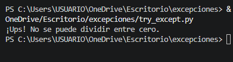

## ¿Por qué da esa salida?
- El programa muestra "¡Ups! No se puede dividir entre cero." porque:

- La línea resultado = 10 / 0 genera un error

- El programa salta al bloque except

- Se ejecuta el print dentro del except

- El programa termina sin mostrar ningún resultado de división

# Ejemplo 2 - Excepciones especificas

```python
try:
    numero = int(input("Introduce un número: "))
    resultado = 100 / numero
    print(f"100 dividido por {numero} es {resultado}")
except ZeroDivisionError:
    print("No puedes dividir entre cero.")
except ValueError:
    print("Debes introducir un número válido.")
```


## Explicación
En este código hay dos posibles excepciones que pueden ocurrir.

Primera excepción posible: ValueError. Ocurre en la línea numero = int(input("Introduce un número: ")) cuando el usuario escribe algo que no es un número. Por ejemplo, si escribe "hola" o "tres", la función int() no puede convertir ese texto a número entero y lanza un ValueError.

Segunda excepción posible: ZeroDivisionError. Ocurre en la línea resultado = 100 / numero cuando el usuario introduce el número 0. Dividir 100 entre 0 no está permitido en matemáticas, por lo que Python lanza un ZeroDivisionError.

Lo importante de este ejemplo es que cada tipo de error tiene su propio bloque except. Si ocurre un ValueError, se ejecuta el primer except y muestra un mensaje sobre entrada inválida. Si ocurre un ZeroDivisionError, se ejecuta el segundo except y muestra un mensaje sobre división entre cero. Si no ocurre ninguna excepción, se ejecuta el print del resultado.

## Salida
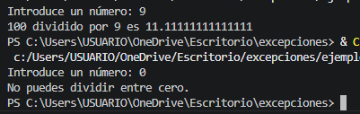

# Ejemplo 3 - Accediendo a la información de la excepción

```python
try:
    with open("archivo_inexistente.txt", "r") as archivo:
        contenido = archivo.read()
except FileNotFoundError as error:
    print(f"Error:{error}")
    print("Creando un archivo nuevo...")
    with open("archivo_inexistente.txt", "w") as archivo:
        archivo.write("Este es un archivo nuevo")
```

## Explicación
En este código se trabaja con archivos, una operación que comúnmente genera excepciones.

El bloque try intenta abrir un archivo llamado "archivo_inexistente.txt" en modo lectura ("r"). Si el archivo no existe en la carpeta del programa, Python no puede abrirlo y genera una excepción de tipo FileNotFoundError.

La novedad de este ejemplo es el uso de "as error" después del tipo de excepción. Esto captura el objeto de la excepción y lo guarda en una variable llamada error. Dentro del bloque except podemos acceder a ese objeto para ver información detallada del error, como el mensaje original que Python habría mostrado.

Cuando se captura el error, el programa no solo muestra el mensaje de error, sino que también crea el archivo que faltaba en modo escritura ("w") y escribe contenido dentro de él. Así, la próxima vez que se ejecute el programa, el archivo ya existirá.

## Salida
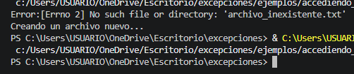

## ¿Por qué da esa salida?
Cuando se ejecuta este programa por primera vez en una carpeta donde no existe el archivo "archivo_inexistente.txt", ocurre lo siguiente:

- Paso 1: El bloque try intenta abrir el archivo en modo lectura.
- Paso 2: Python busca el archivo y no lo encuentra.
- Paso 3: Python genera una excepción FileNotFoundError con un mensaje que dice algo como "[Errno 2] No such file or directory: 'archivo_inexistente.txt'".
- Paso 4: La excepción se captura en el except y se guarda en la variable error.
- Paso 5: Se ejecuta print(f"Error:{error}") que muestra el mensaje original del error.
- Paso 6: Se muestra "Creando un archivo nuevo..."
- Paso 7: Se abre el mismo archivo pero ahora en modo escritura ("w"), lo que CREA el archivo si no existe.
- Paso 8: Se escribe "Este es un archivo nuevo" dentro del archivo.
- Paso 9: El programa termina.

Después de ejecutar el programa una vez, el archivo queda creado en la carpeta. Si se ejecuta nuevamente, ya no se generará la excepción porque el archivo existe.

# Ejemplo 4 - Combinando multiples excepciones

```python
try:
    # Intentamos abrir y leer un archivo
    archivo = open("datos.txt", "r")
    valor = int(archivo.readline().strip())
    resultado = 100 / valor
except (FileNotFoundError, ValueError, ZeroDivisionError) as e:
    print(f"Ocurrió un error:{type(e).__name__}")
    print(f"Descripción:{e}")
```

## Explicación
Este código muestra cómo agrupar varios tipos de excepciones en un SOLO bloque except usando una tupla.

Dentro del bloque try hay tres operaciones que pueden fallar de diferentes maneras.

Primera operación: archivo = open("datos.txt", "r"). Si el archivo "datos.txt" no existe, se genera FileNotFoundError.

Segunda operación: valor = int(archivo.readline().strip()). Si el archivo está vacío o contiene texto que no es un número, se genera ValueError.

Tercera operación: resultado = 100 / valor. Si el valor leído del archivo es 0, se genera ZeroDivisionError.

En lugar de escribir tres bloques except separados (uno para cada error), se agrupan los tres tipos de excepción en una tupla: (FileNotFoundError, ValueError, ZeroDivisionError). Si ocurre CUALQUIERA de estos tres errores, se ejecuta el mismo bloque except.

Dentro del except se usa "as e" para capturar el objeto de la excepción. La función type(e).name devuelve el nombre del tipo de error que ocurrió (por ejemplo "FileNotFoundError", "ValueError" o "ZeroDivisionError"). Esto permite saber exactamente qué error pasó aunque todos se manejen en el mismo lugar.

## Salida 
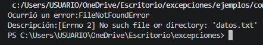

## ¿Por qué da esa salida?
- Paso 1: try intenta abrir "datos.txt".
- Paso 2: El archivo no existe, Python genera FileNotFoundError.
- Paso 3: Como FileNotFoundError está en la tupla, se ejecuta el except.
- Paso 4: type(e).name devuelve "FileNotFoundError".
Paso 5: e contiene el mensaje original del error.

# Ejemplo 5 - Uso práctico en aplicaciones reales

```python
def obtener_edad():
    while True:
        try:
            edad = int(input("¿Cuál es tu edad? "))
            if edad < 0:
                print("La edad no puede ser negativa.")
                continue
            return edad
        except ValueError:
            print("Por favor, introduce un número entero.")

# Uso de la función
edad_usuario = obtener_edad()
print(f"Tu edad es:{edad_usuario}")
```

## Explicación
Este código muestra un patrón muy común en programación: validar entrada de usuario hasta que sea correcta. El bucle while True se repite infinitamente hasta que se encuentra un return.

El try intenta convertir la entrada del usuario a número entero. Si el usuario escribe algo que no es un número, se genera ValueError y el except muestra un mensaje de error. Como no hay return ni break, el bucle continúa preguntando nuevamente.

Si la conversión es exitosa, se verifica que la edad no sea negativa. Si lo es, se muestra un mensaje y se usa continue para volver al inicio del bucle. Si la edad es válida, se ejecuta return y la función termina devolviendo ese valor.

## Salida
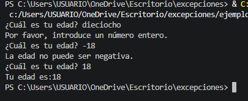

## ¿Por qué da esa salida?

- "dieciocho" no es un número, por eso el programa pide un número entero.

- "-18" es un número pero es negativo, por eso el programa dice que la edad no puede ser negativa.

- "18" es un número válido y positivo, por eso el programa muestra la edad y termina.

# Ejemplo 6 - Buenas prácticas

```python
# Mal ejemplo: bloque try demasiado grande
try:
    archivo = open("datos.txt", "r")
    contenido = archivo.read()
    numeros = [int(x) for x in contenido.split()]
    resultado = sum(numeros) / len(numeros)
    print(f"El promedio es:{resultado}")
    archivo.close()
except:
    print("Ocurrió un error")

# Buen ejemplo: bloques try específicos
try:
    archivo = open("datos.txt", "r")
except FileNotFoundError:
    print("El archivo 'datos.txt' no existe")
else:
    try:
        contenido = archivo.read()
        numeros = [int(x) for x in contenido.split()]
    except ValueError:
        print("El archivo contiene datos que no son números")
    else:
        try:
            resultado = sum(numeros) / len(numeros)
            print(f"El promedio es:{resultado}")
        except ZeroDivisionError:
            print("El archivo está vacío, no se puede calcular el promedio")
    finally:
        archivo.close()
```

## Error original y corrección
El error en el código original es que usaba "return" dentro de los bloques except. El return solo funciona dentro de una función, pero este código no está dentro de ninguna función. Al ejecutarlo, Python mostraría un error "SyntaxError: 'return' outside function".

La corrección consiste en eliminar los return y reestructurar el código usando else y finally. Ahora el archivo se cierra siempre en el finally, y los errores se manejan sin necesidad de return.

## Explicación
El mal ejemplo usa un solo try enorme y un except genérico. Si ocurre cualquier error (archivo no existe, datos no numéricos, división por cero, etc.), solo muestra "Ocurrió un error" sin decir qué pasó realmente.

El buen ejemplo divide el código en pequeños bloques try. Cada bloque maneja un error específico: FileNotFoundError si falta el archivo, ValueError si los datos no son números, ZeroDivisionError si el archivo está vacío. Además, el finally asegura que archivo.close() se ejecute siempre.

## Salida
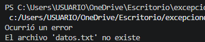

El programa muestra dos mensajes porque dentro del mismo archivo hay dos ejemplos. Primero se ejecuta el "mal ejemplo", que usa un except genérico y solo dice "Ocurrió un error" sin importar qué falló. Luego se ejecuta el "buen ejemplo", que captura específicamente FileNotFoundError y muestra "El archivo 'datos.txt' no existe". Ambos mensajes aparecen porque son dos códigos distintos uno detrás del otro.

# Ejemplo 7 - Tipos comunes: ZeroDivisionError

```python
try:
    resultado = 5 / 0
except ZeroDivisionError:
    print("No es posible dividir entre cero")
```
## Salida
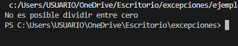

## Explicación
El programa intenta dividir 5 entre 0. Como dividir por cero no está permitido, Python genera un ZeroDivisionError. El bloque except captura específicamente ese error y muestra el mensaje "No es posible dividir entre cero". Sin el try-except, el programa habría terminado con un mensaje de error rojo.

# Ejemplo 8 - Tipos comunes: OverflowError

```python
try:
    resultado = 10.0 ** 1000000  # Intentar calcular 10 elevado a un millón
except OverflowError:
    print("El número es demasiado grande para ser representado")
```

## Salida
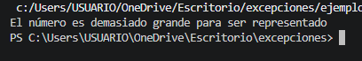

## Explicación
El programa intenta calcular 10 elevado a un millón. Ese número es tan enorme que Python no puede representarlo, por lo que genera un OverflowError. El except captura el error y muestra el mensaje.

# Ejemplo 9 - Excepciones relacionadas con tipos de datos: TypeError

```python
try:
    resultado = "42" + 10  # Intentar sumar un string y un entero
except TypeError:
    print("No se pueden sumar tipos diferentes")
```

## Salida
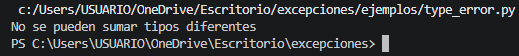

## Explicación
El programa intenta sumar un string "42" y un número entero 10. Python no permite sumar tipos de datos diferentes, por lo que genera un TypeError. El except captura el error y muestra el mensaje.

# Ejemplo 10 - Excepciones relacionadas con tipos de datos: ValueError

```python
try:
    numero = int("abc")  # Intentar convertir una cadena no numérica a entero
except ValueError:
    print("La cadena no representa un número válido")
```
## Salida
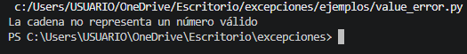

## Explicación
El programa intenta convertir el texto "abc" a número entero. Como no es un número válido, Python genera un ValueError. El except captura el error y muestra el mensaje.

# Ejemplo 11 - Excepciones relacionadas con índices y claves: IndexError

```python
try:
    lista = [1, 2, 3]
    elemento = lista[10]  # Intentar acceder a un índice que no existe
except IndexError:
    print("El índice está fuera del rango de la lista")
```

## Salida
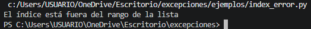

## Explicación
La lista tiene solo 3 elementos, con índices 0, 1 y 2. Se intenta acceder al índice 10, que no existe. Python genera un IndexError. El except lo captura y muestra el mensaje.

# Ejemplo 12 - Excepciones relacionadas con índices y claves: KeyError

```python
try:
    diccionario = {"nombre": "Ana", "edad": 25}
    valor = diccionario["telefono"]  # Intentar acceder a una clave inexistente
except KeyError:
    print("La clave 'telefono' no existe en el diccionario")
```

## Salida
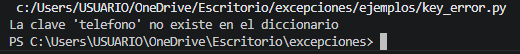

## Explicación
El diccionario tiene las claves "nombre" y "edad", pero no tiene la clave "telefono". Al intentar acceder a ella, Python genera un KeyError. El except captura el error y muestra el mensaje.

# Ejemplo 13 - Excepciones relacionadas con archivos: FileNotFoundError

try:
    with open("archivo_inexistente.txt", "r") as archivo:
        contenido = archivo.read()
except FileNotFoundError:
    print("El archivo no existe")

## Salida
(No se muestra nada)

## Explicación
No se ve ningún mensaje, significa que el archivo "archivo_inexistente.txt" ya existe. El programa lo abre sin problemas y no ocurre ninguna excepción, por eso el except no se ejecuta y no se imprime nada. Para que aparezca el mensaje, el archivo no debe existir.