# Ejemplo 1 - Try-Except básico con división entre cero

```python
try:
    numero1 = 10
    numero2 = 0
    resultado = numero1 / numero2
    print(f"El resultado es:{resultado}")
except:
    print("¡Ups! No se puede dividir entre cero.")

```
## Explicación
En este código, la división numero1 / numero2 intenta dividir 10 entre 0. En matemáticas y en programación, dividir cualquier número entre cero no está permitido. Python detecta este error y genera automáticamente una excepción llamada ZeroDivisionError.

El bloque try envuelve el código que podría fallar. Cuando ocurre el ZeroDivisionError, Python inmediatamente deja de ejecutar el resto del código dentro del try (nunca llega a ejecutar el print del resultado) y salta al bloque except. Como no especificamos ningún tipo de excepción en el except, este captura CUALQUIER error que ocurra.

## Salida


## ¿Por qué da esa salida?
- El programa muestra "¡Ups! No se puede dividir entre cero." porque:

- La línea resultado = 10 / 0 genera un error

- El programa salta al bloque except

- Se ejecuta el print dentro del except

- El programa termina sin mostrar ningún resultado de división

# Ejemplo 2 - Excepciones especificas

```python
try:
    numero = int(input("Introduce un número: "))
    resultado = 100 / numero
    print(f"100 dividido por {numero} es {resultado}")
except ZeroDivisionError:
    print("No puedes dividir entre cero.")
except ValueError:
    print("Debes introducir un número válido.")
```


## Explicación
En este código hay dos posibles excepciones que pueden ocurrir.

Primera excepción posible: ValueError. Ocurre en la línea numero = int(input("Introduce un número: ")) cuando el usuario escribe algo que no es un número. Por ejemplo, si escribe "hola" o "tres", la función int() no puede convertir ese texto a número entero y lanza un ValueError.

Segunda excepción posible: ZeroDivisionError. Ocurre en la línea resultado = 100 / numero cuando el usuario introduce el número 0. Dividir 100 entre 0 no está permitido en matemáticas, por lo que Python lanza un ZeroDivisionError.

Lo importante de este ejemplo es que cada tipo de error tiene su propio bloque except. Si ocurre un ValueError, se ejecuta el primer except y muestra un mensaje sobre entrada inválida. Si ocurre un ZeroDivisionError, se ejecuta el segundo except y muestra un mensaje sobre división entre cero. Si no ocurre ninguna excepción, se ejecuta el print del resultado.

## Salida


# Ejemplo 3 - Accediendo a la información de la excepción

```python
try:
    with open("archivo_inexistente.txt", "r") as archivo:
        contenido = archivo.read()
except FileNotFoundError as error:
    print(f"Error:{error}")
    print("Creando un archivo nuevo...")
    with open("archivo_inexistente.txt", "w") as archivo:
        archivo.write("Este es un archivo nuevo")
```

## Explicación
En este código se trabaja con archivos, una operación que comúnmente genera excepciones.

El bloque try intenta abrir un archivo llamado "archivo_inexistente.txt" en modo lectura ("r"). Si el archivo no existe en la carpeta del programa, Python no puede abrirlo y genera una excepción de tipo FileNotFoundError.

La novedad de este ejemplo es el uso de "as error" después del tipo de excepción. Esto captura el objeto de la excepción y lo guarda en una variable llamada error. Dentro del bloque except podemos acceder a ese objeto para ver información detallada del error, como el mensaje original que Python habría mostrado.

Cuando se captura el error, el programa no solo muestra el mensaje de error, sino que también crea el archivo que faltaba en modo escritura ("w") y escribe contenido dentro de él. Así, la próxima vez que se ejecute el programa, el archivo ya existirá.

## Salida


## ¿Por qué da esa salida?
Cuando se ejecuta este programa por primera vez en una carpeta donde no existe el archivo "archivo_inexistente.txt", ocurre lo siguiente:

- Paso 1: El bloque try intenta abrir el archivo en modo lectura.
- Paso 2: Python busca el archivo y no lo encuentra.
- Paso 3: Python genera una excepción FileNotFoundError con un mensaje que dice algo como "[Errno 2] No such file or directory: 'archivo_inexistente.txt'".
- Paso 4: La excepción se captura en el except y se guarda en la variable error.
- Paso 5: Se ejecuta print(f"Error:{error}") que muestra el mensaje original del error.
- Paso 6: Se muestra "Creando un archivo nuevo..."
- Paso 7: Se abre el mismo archivo pero ahora en modo escritura ("w"), lo que CREA el archivo si no existe.
- Paso 8: Se escribe "Este es un archivo nuevo" dentro del archivo.
- Paso 9: El programa termina.

Después de ejecutar el programa una vez, el archivo queda creado en la carpeta. Si se ejecuta nuevamente, ya no se generará la excepción porque el archivo existe.

# Ejemplo 4 - Combinando multiples excepciones

```python
try:
    # Intentamos abrir y leer un archivo
    archivo = open("datos.txt", "r")
    valor = int(archivo.readline().strip())
    resultado = 100 / valor
except (FileNotFoundError, ValueError, ZeroDivisionError) as e:
    print(f"Ocurrió un error:{type(e).__name__}")
    print(f"Descripción:{e}")
```

## Explicación
Este código muestra cómo agrupar varios tipos de excepciones en un SOLO bloque except usando una tupla.

Dentro del bloque try hay tres operaciones que pueden fallar de diferentes maneras.

Primera operación: archivo = open("datos.txt", "r"). Si el archivo "datos.txt" no existe, se genera FileNotFoundError.

Segunda operación: valor = int(archivo.readline().strip()). Si el archivo está vacío o contiene texto que no es un número, se genera ValueError.

Tercera operación: resultado = 100 / valor. Si el valor leído del archivo es 0, se genera ZeroDivisionError.

En lugar de escribir tres bloques except separados (uno para cada error), se agrupan los tres tipos de excepción en una tupla: (FileNotFoundError, ValueError, ZeroDivisionError). Si ocurre CUALQUIERA de estos tres errores, se ejecuta el mismo bloque except.

Dentro del except se usa "as e" para capturar el objeto de la excepción. La función type(e).name devuelve el nombre del tipo de error que ocurrió (por ejemplo "FileNotFoundError", "ValueError" o "ZeroDivisionError"). Esto permite saber exactamente qué error pasó aunque todos se manejen en el mismo lugar.

## Salida 


## ¿Por qué da esa salida?
- Paso 1: try intenta abrir "datos.txt".
- Paso 2: El archivo no existe, Python genera FileNotFoundError.
- Paso 3: Como FileNotFoundError está en la tupla, se ejecuta el except.
- Paso 4: type(e).name devuelve "FileNotFoundError".
Paso 5: e contiene el mensaje original del error.

# Ejemplo 5 - Uso práctico en aplicaciones reales

```python
def obtener_edad():
    while True:
        try:
            edad = int(input("¿Cuál es tu edad? "))
            if edad < 0:
                print("La edad no puede ser negativa.")
                continue
            return edad
        except ValueError:
            print("Por favor, introduce un número entero.")

# Uso de la función
edad_usuario = obtener_edad()
print(f"Tu edad es:{edad_usuario}")
```

## Explicación
Este código muestra un patrón muy común en programación: validar entrada de usuario hasta que sea correcta. El bucle while True se repite infinitamente hasta que se encuentra un return.

El try intenta convertir la entrada del usuario a número entero. Si el usuario escribe algo que no es un número, se genera ValueError y el except muestra un mensaje de error. Como no hay return ni break, el bucle continúa preguntando nuevamente.

Si la conversión es exitosa, se verifica que la edad no sea negativa. Si lo es, se muestra un mensaje y se usa continue para volver al inicio del bucle. Si la edad es válida, se ejecuta return y la función termina devolviendo ese valor.

## Salida


## ¿Por qué da esa salida?

- "dieciocho" no es un número, por eso el programa pide un número entero.

- "-18" es un número pero es negativo, por eso el programa dice que la edad no puede ser negativa.

- "18" es un número válido y positivo, por eso el programa muestra la edad y termina.

# Ejemplo 6 - Buenas prácticas

```python
# Mal ejemplo: bloque try demasiado grande
try:
    archivo = open("datos.txt", "r")
    contenido = archivo.read()
    numeros = [int(x) for x in contenido.split()]
    resultado = sum(numeros) / len(numeros)
    print(f"El promedio es:{resultado}")
    archivo.close()
except:
    print("Ocurrió un error")

# Buen ejemplo: bloques try específicos
try:
    archivo = open("datos.txt", "r")
except FileNotFoundError:
    print("El archivo 'datos.txt' no existe")
else:
    try:
        contenido = archivo.read()
        numeros = [int(x) for x in contenido.split()]
    except ValueError:
        print("El archivo contiene datos que no son números")
    else:
        try:
            resultado = sum(numeros) / len(numeros)
            print(f"El promedio es:{resultado}")
        except ZeroDivisionError:
            print("El archivo está vacío, no se puede calcular el promedio")
    finally:
        archivo.close()
```

## Error original y corrección
El error en el código original es que usaba "return" dentro de los bloques except. El return solo funciona dentro de una función, pero este código no está dentro de ninguna función. Al ejecutarlo, Python mostraría un error "SyntaxError: 'return' outside function".

La corrección consiste en eliminar los return y reestructurar el código usando else y finally. Ahora el archivo se cierra siempre en el finally, y los errores se manejan sin necesidad de return.

## Explicación
El mal ejemplo usa un solo try enorme y un except genérico. Si ocurre cualquier error (archivo no existe, datos no numéricos, división por cero, etc.), solo muestra "Ocurrió un error" sin decir qué pasó realmente.

El buen ejemplo divide el código en pequeños bloques try. Cada bloque maneja un error específico: FileNotFoundError si falta el archivo, ValueError si los datos no son números, ZeroDivisionError si el archivo está vacío. Además, el finally asegura que archivo.close() se ejecute siempre.

## Salida


El programa muestra dos mensajes porque dentro del mismo archivo hay dos ejemplos. Primero se ejecuta el "mal ejemplo", que usa un except genérico y solo dice "Ocurrió un error" sin importar qué falló. Luego se ejecuta el "buen ejemplo", que captura específicamente FileNotFoundError y muestra "El archivo 'datos.txt' no existe". Ambos mensajes aparecen porque son dos códigos distintos uno detrás del otro.

# Ejemplo 7 - Tipos comunes: ZeroDivisionError

```python
try:
    resultado = 5 / 0
except ZeroDivisionError:
    print("No es posible dividir entre cero")
```
## Salida


## Explicación
El programa intenta dividir 5 entre 0. Como dividir por cero no está permitido, Python genera un ZeroDivisionError. El bloque except captura específicamente ese error y muestra el mensaje "No es posible dividir entre cero". Sin el try-except, el programa habría terminado con un mensaje de error rojo.

# Ejemplo 8 - Tipos comunes: OverflowError

```python
try:
    resultado = 10.0 ** 1000000  # Intentar calcular 10 elevado a un millón
except OverflowError:
    print("El número es demasiado grande para ser representado")
```

## Salida


## Explicación
El programa intenta calcular 10 elevado a un millón. Ese número es tan enorme que Python no puede representarlo, por lo que genera un OverflowError. El except captura el error y muestra el mensaje.

# Ejemplo 9 - Excepciones relacionadas con tipos de datos: TypeError

```python
try:
    resultado = "42" + 10  # Intentar sumar un string y un entero
except TypeError:
    print("No se pueden sumar tipos diferentes")
```

## Salida


## Explicación
El programa intenta sumar un string "42" y un número entero 10. Python no permite sumar tipos de datos diferentes, por lo que genera un TypeError. El except captura el error y muestra el mensaje.

# Ejemplo 10 - Excepciones relacionadas con tipos de datos: ValueError

```python
try:
    numero = int("abc")  # Intentar convertir una cadena no numérica a entero
except ValueError:
    print("La cadena no representa un número válido")
```
## Salida


## Explicación
El programa intenta convertir el texto "abc" a número entero. Como no es un número válido, Python genera un ValueError. El except captura el error y muestra el mensaje.

# Ejemplo 11 - Excepciones relacionadas con índices y claves: IndexError

```python
try:
    lista = [1, 2, 3]
    elemento = lista[10]  # Intentar acceder a un índice que no existe
except IndexError:
    print("El índice está fuera del rango de la lista")
```

## Salida


## Explicación
La lista tiene solo 3 elementos, con índices 0, 1 y 2. Se intenta acceder al índice 10, que no existe. Python genera un IndexError. El except lo captura y muestra el mensaje.

# Ejemplo 12 - Excepciones relacionadas con índices y claves: KeyError

```python
try:
    diccionario = {"nombre": "Ana", "edad": 25}
    valor = diccionario["telefono"]  # Intentar acceder a una clave inexistente
except KeyError:
    print("La clave 'telefono' no existe en el diccionario")
```

## Salida


## Explicación
El diccionario tiene las claves "nombre" y "edad", pero no tiene la clave "telefono". Al intentar acceder a ella, Python genera un KeyError. El except captura el error y muestra el mensaje.

# Ejemplo 13 - Excepciones relacionadas con archivos: FileNotFoundError

```python
try:
    with open("archivo_inexistente.txt", "r") as archivo:
        contenido = archivo.read()
except FileNotFoundError:
    print("El archivo no existe")
```

## Salida
(No se muestra nada)

## Explicación
No se ve ningún mensaje, significa que el archivo "archivo_inexistente.txt" ya existe. El programa lo abre sin problemas y no ocurre ninguna excepción, por eso el except no se ejecuta y no se imprime nada. Para que aparezca el mensaje, el archivo no debe existir.

# Ejemplo 14 - Excepciones relacionadas con archivos: PermissionError

```python
try:
    with open("/etc/passwd", "w") as archivo:  # Intentar escribir en un archivo protegido
        archivo.write("datos")
except PermissionError:
    print("No tienes permisos para modificar este archivo")
```
## Salida
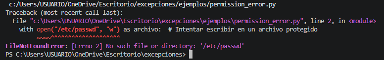

## Explicación
El código está diseñado para mostrar PermissionError al intentar escribir en un archivo protegido como "/etc/passwd". Pero en Windows esa ruta no existe, por lo que el error que sale es FileNotFoundError.

# Ejemplo 15 - Excepciones relacionadas con atributos y nombres: AttributeError

```python
try:
    texto = "Hola"
    longitud = texto.size  # El método correcto sería len(texto) o texto.__len__()
except AttributeError:
    print("El objeto string no tiene el atributo 'size'")
```
## Salida
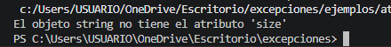

## Explicación
El programa intenta acceder al atributo "size" de un string. Los strings en Python no tienen un atributo llamado "size" (el correcto es len(texto) o el método .len()). Por eso Python genera un AttributeError. El except captura el error y muestra el mensaje.

# Ejemplo 16 - Excepciones relacionadas con atributos y nombres: NameError

```python
try:
    print(variable_no_definida)  # Intentar usar una variable que no existe
except NameError:
    print("La variable no está definida")
```

## Salida
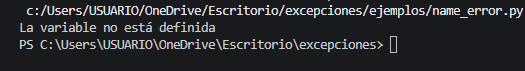

## Explicación
El programa intenta imprimir una variable llamada "variable_no_definida" que nunca fue creada. Como no existe, Python genera un NameError. El except captura el error y muestra el mensaje.

# Ejemplo 17 - Excepciones relacionadas con importaciones: ImportError

```python
try:
    import biblioteca_inexistente
except ImportError:
    print("No se pudo importar el módulo")
```
## Salida
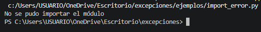

## Explicación
El programa intenta importar un módulo llamado "biblioteca_inexistente" que no existe en Python. Eso genera un ImportError. El except captura el error y muestra el mensaje.

# Ejercicio 18 - Excepciones relacionadas con importaciones: ModuleNotFoundError

```python
try:
    import modulo_que_no_existe
except ModuleNotFoundError:
    print("El módulo no existe")
```
## Salida
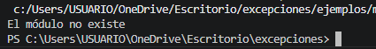

## Explicación
El programa intenta importar un módulo llamado "modulo_que_no_existe" que no está instalado ni existe en Python. Python genera ModuleNotFoundError (que es una subclase de ImportError). El except captura ese error específico y muestra el mensaje.

# Ejercicio 19 - Jerarquia de excepciones

```python
try:
    # Código que podría generar diferentes tipos de excepciones
    resultado = int("abc") / 0
except Exception as e:
    print(f"Se produjo un error:{type(e).__name__}")
    print(f"Descripción:{e}")
```
## Salida
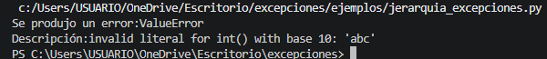

## Explicación
El código intenta convertir "abc" a entero. Eso genera un ValueError, que es una subclase de Exception. Como el except captura Exception (la clase padre), atrapa cualquier excepción que herede de ella. Muestra el tipo específico del error (ValueError) y su descripción. La división entre cero nunca se alcanza porque el error ocurre antes.

# Ejemplo 20 - Identificando el tipo de excepción

```python
try:
    # Código que podría fallar
    resultado = eval(input("Introduce una expresión: "))
except Exception as e:
    print(f"Error de tipo:{type(e).__name__}")
    print(f"Descripción:{e}")
```

## Salida
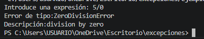

## Explicación
eval() intenta ejecutar lo que el usuario escriba. Si ocurre cualquier error, el except captura Exception (la clase padre de casi todas las excepciones) y muestra el nombre exacto del error y su descripción. Es útil para descubrir qué excepciones específicas manejar después.

# Ejemplo 21 - Excepciones en bibliotecas externas

```python
import requests

try:
    respuesta = requests.get("https://api.ejemplo.com/datos", timeout=1)
    respuesta.raise_for_status()  # Lanza una excepción si el código de estado HTTP es un error
except requests.exceptions.ConnectionError:
    print("No se pudo conectar al servidor")
except requests.exceptions.Timeout:
    print("La solicitud excedió el tiempo de espera")
except requests.exceptions.HTTPError as e:
    print(f"Error HTTP:{e}")
```

## Explicación
El código intenta hacer una solicitud HTTP a una URL falsa ("https://api.ejemplo.com/datos") usando la biblioteca requests.

## Salida
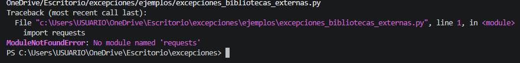

Esto ocurre porque la biblioteca requests no está instalada.

# Ejemplo 22 - La cláusula else

```python
try:
    numero = int(input("Introduce un número: "))
    resultado = 100 / numero
except ValueError:
    print("Debes introducir un número válido.")
except ZeroDivisionError:
    print("No puedes dividir entre cero.")
else:
    print(f"El resultado es:{resultado}")
    # Este código solo se ejecuta si no hubo excepciones
```

## ¿Qué hace el código?
Pide un número al usuario, lo convierte a entero y divide 100 entre ese número. Si ocurre un error de conversión (ValueError) o de división entre cero (ZeroDivisionError), muestra un mensaje de error. Si no ocurre ninguna excepción, se ejecuta el bloque else y muestra el resultado de la división.

## Salida
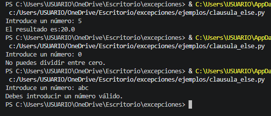

## Explicación:
- Con entrada "5": No hay excepciones. El bloque else se ejecuta y muestra el resultado 100/5 = 20.0.

- Con entrada "0": La conversión a entero funciona, pero 100/0 lanza ZeroDivisionError. Se ejecuta el except correspondiente y muestra "No puedes dividir entre cero". El else no se ejecuta.

- Con entrada "abc": int("abc") lanza ValueError. Se ejecuta el except ValueError y muestra "Debes introducir un número válido". El else tampoco se ejecuta.

# Ejemplo 23 - Casos de usos practicos para else: Else con archivos

```python
try:
    archivo = open("datos.txt", "r")
    contenido = archivo.read()
except FileNotFoundError:
    print("El archivo no existe.")
    contenido = ""
else:
    print("Archivo leído correctamente.")
    archivo.close()  # Solo cerramos si se abrió con éxito
```

## ¿Qué hace el código?
Intenta abrir y leer el archivo "datos.txt". Si el archivo no existe, entra al except y asigna contenido = "". Si el archivo existe y se lee sin problemas, entra al else, muestra un mensaje de éxito y cierra el archivo.

## Salida
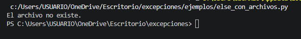

## Explicación del manejo de excepciones
- El try contiene las operaciones que pueden fallar (abrir y leer el archivo).

- El except captura específicamente FileNotFoundError (si el archivo no existe) y evita que el programa se rompa.

- El else se ejecuta solo si no ocurrió ninguna excepción en el try. Por eso dentro del else se puede cerrar el archivo con seguridad, porque sabemos que se abrió correctamente.

# Ejemplo 24 - Casos de usos practicos para else: Else con multiples operaciones

```python
try:
        datos = obtener_datos_de_api()
        validar_formato(datos)
except ConexionError:
    print("No se pudo conectar con el servidor.")
except FormatoInvalidoError:
    print("Los datos recibidos tienen un formato incorrecto.")
else:
    # Solo procesamos si obtuvimos y validamos los datos correctamente
    resultados = procesar_datos(datos)
    guardar_resultados(resultados)
```

## ¿Qué hace el código?
Intenta obtener datos de una API y luego validar su formato. Si falla la conexión (ConexionError), muestra un mensaje. Si falla la validación (FormatoInvalidoError), muestra otro mensaje. Si ambas operaciones tienen éxito, entonces en el else procesa y guarda los datos.

## Salida
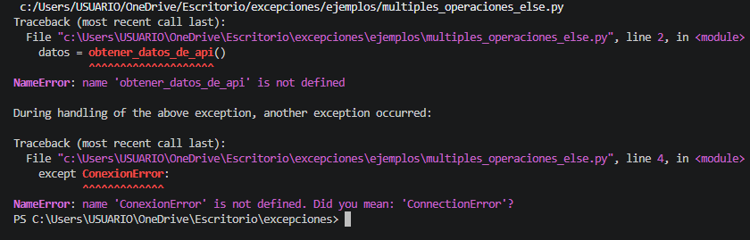

## Explicación del manejo de excepciones
- El bloque try agrupa las dos operaciones que podrían fallar (obtener datos y validar).

- Cada tipo de error tiene su propio except para dar un mensaje específico.

- El else se ejecuta solo cuando no ocurre ninguna excepción, lo que garantiza que datos y su formato son válidos. Así se evita anidar código dentro del try y se separa claramente la lógica normal del manejo de errores.

# Ejemplo 25 - La cláusula finally

```python
try:
    archivo = open("registro.txt", "w")
    archivo.write("Operación iniciada\n")
    # Código que podría generar una excepción
    resultado = 10 / int(input("Introduce un número: "))
    archivo.write(f"Resultado:{resultado}\n")
except ZeroDivisionError:
    archivo.write("Error: División por cero\n")
except ValueError:
    archivo.write("Error: Valor no válido\n")
finally:
    archivo.write("Operación finalizada\n")
    archivo.close()  # El archivo se cierra siempre
    print("Proceso completado")
```

## ¿Qué hace el código?
Abre un archivo llamado "registro.txt" para escribir. Escribe "Operación iniciada". Pide un número al usuario, lo divide 10 entre ese número y escribe el resultado. Si ocurre división entre cero (ZeroDivisionError) o error de conversión (ValueError), escribe el error correspondiente. Finalmente, SIEMPRE escribe "Operación finalizada", cierra el archivo y muestra "Proceso completado".

## Salida
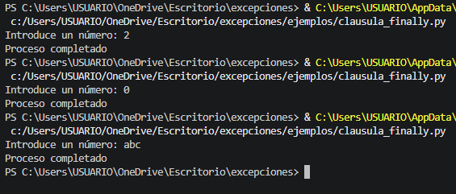

## Explicación del manejo de excepciones
El bloque finally se ejecuta siempre, haya o no excepción. Aquí se usa para cerrar el archivo y mostrar el mensaje final, garantizando que no quede el archivo abierto y que el usuario sepa que el proceso terminó.

# Ejemplo 26 - Casos de uso prácticos para finally: Liberar recursos

```python
conexion = None
try:
    conexion = conectar_a_base_de_datos()
    datos = conexion.ejecutar_consulta("SELECT * FROM usuarios")
    procesar_datos(datos)
except ConexionError:
    print("Error al conectar con la base de datos")
except ConsultaError:
    print("Error al ejecutar la consulta")
finally:
    if conexion:
        conexion.cerrar()  # La conexión se cierra siempre
```

## ¿Qué hace el código?
Intenta conectar a una base de datos, ejecutar una consulta y procesar los datos. Si falla la conexión (ConexionError) o la consulta (ConsultaError), muestra el error correspondiente. El bloque finally se ejecuta siempre: si la conexión se estableció (conexion no es None), la cierra, liberando el recurso.

## Salida
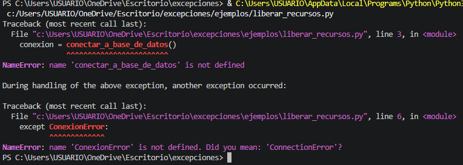

## Explicación del manejo de excepciones
- try: código que puede fallar (conexión, consulta, procesamiento).

- except ConexionError: se ejecuta si falla conectar_a_base_de_datos().

- except ConsultaError: se ejecuta si falla ejecutar_consulta().

- finally: asegura que conexion.cerrar() se ejecute siempre que la conexión se haya creado. Esto evita fugas de recursos.

# Ejemplo 27 - Casos de uso prácticos para finally: Restaurar estados

```python
modo_original = sistema.obtener_modo()
try:
    sistema.cambiar_modo("mantenimiento")
    realizar_actualizacion()
except ActualizacionError:
    print("La actualización falló")
finally:
    sistema.cambiar_modo(modo_original)  # Restauramos el modo original
```

## ¿Qué hace el código?
Guarda el modo actual del sistema en modo_original. Luego intenta cambiar el sistema a modo "mantenimiento" y realizar una actualización. Si la actualización falla (se lanza ActualizacionError), muestra un mensaje. El bloque finally se ejecuta siempre y restaura el modo original del sistema, sin importar si la actualización fue exitosa o falló.

## Salida
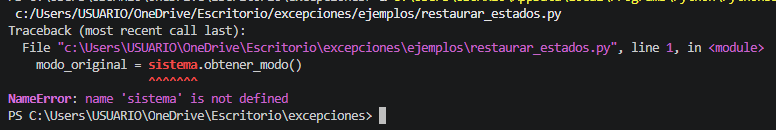

## Explicación del manejo de excepciones
- try: cambia el modo a "mantenimiento" y ejecuta la actualización.

- except ActualizacionError: captura solo errores específicos de actualización y muestra un mensaje.

- finally: restaura el modo original. Esto garantiza que el sistema nunca quede en modo "mantenimiento" si algo sale mal.

## ¿Por qué es útil?
Es una buena práctica para mantener la consistencia del sistema. Por ejemplo, si un programa cambia una configuración crítica, debe asegurarse de devolverla a su estado original incluso si ocurre un error. El finally es el lugar ideal para esa limpieza.

# Ejemplo 28 - Casos de uso prácticos para finally: Registrar finalización

```python
try:
    registrar_inicio("tarea_diaria")
    ejecutar_tarea_diaria()
except Exception as e:
    registrar_error("tarea_diaria", str(e))
finally:
    registrar_finalizacion("tarea_diaria")  # Siempre registramos que terminó
```

## ¿Qué hace el código?
Registra el inicio de una tarea llamada "tarea_diaria", luego intenta ejecutarla. Si ocurre cualquier error (capturado con Exception), registra el error con su descripción. El bloque finally se ejecuta siempre y registra la finalización de la tarea, haya ocurrido un error o no.

## Explicación del manejo de excepciones
- try: ejecuta el registro de inicio y la tarea principal.

- except Exception as e: captura cualquier excepción que herede de Exception (prácticamente todas las excepciones comunes). Registra el error.

- finally: asegura que registrar_finalizacion() se ejecute siempre, sin importar si la tarea terminó bien o mal. Esto permite llevar un registro completo de cuándo comienza y termina un proceso, incluso cuando falla.

# Ejemplo 29 - Combinando else y finally

```python
try:
    archivo = open("datos.txt", "r")
    contenido = archivo.read()
except FileNotFoundError:
    print("El archivo no existe, se creará uno nuevo.")
    archivo = open("datos.txt", "w")
    archivo.write("Archivo creado automáticamente")
else:
    print(f"Contenido leído:{contenido}")
    # Este código solo se ejecuta si no hubo excepciones
finally:
    print("Operación de archivo completada.")
    archivo.close()  # El archivo se cierra siempre, se haya abierto para leer o escribir
```

## ¿Qué hace el código?
- Intenta abrir y leer el archivo "datos.txt".

- Si el archivo NO existe (FileNotFoundError), lo crea en modo escritura y escribe un mensaje.

- Si el archivo SÍ existe y se lee sin problemas, el bloque else muestra su contenido.

- El bloque finally se ejecuta siempre: imprime "Operación de archivo completada." y cierra el archivo (tanto si se abrió para leer como si se creó para escribir).

## Salida
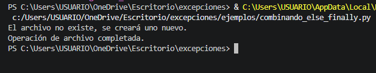

## Explicación del manejo de excepciones
- try: código que puede fallar (abrir y leer).

- except FileNotFoundError: solo captura la ausencia del archivo. En lugar de mostrar un error, crea el archivo.

- else: se ejecuta solo si el try terminó sin excepciones (el archivo existía y se leyó). Aquí se muestra el contenido.

- finally: se ejecuta siempre, independientemente de lo que pasó. Garantiza que el archivo se cierre, evitando fugas de recursos. También muestra el mensaje de finalización.

# Ejemplo 30 - Orden de ejecución

```python
def demostrar_orden():
    try:
        print("1. Ejecutando bloque try")
        # x = 1 / 0  # Descomentar para generar una excepción
    except ZeroDivisionError:
        print("2. Ejecutando bloque except")
    else:
        print("3. Ejecutando bloque else")
    finally:
        print("4. Ejecutando bloque finally")
    
    print("5. Continuando después del bloque try")

demostrar_orden()
```

## ¿Qué hace el código?
Define una función que muestra el orden en que se ejecutan los bloques try, except, else y finally. En este caso, como no hay ninguna excepción (la división entre cero está comentada), el flujo es: se ejecuta try, luego else (porque no hubo excepción), luego finally, y finalmente la línea fuera del bloque.

## Salida
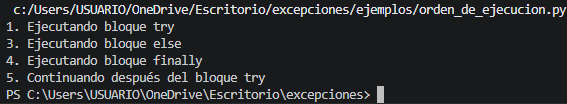

## Explicación del manejo de excepciones
- El bloque try se ejecuta primero.

- Como no ocurre ninguna excepción, se salta el except y se ejecuta el else.

- El finally se ejecuta siempre, al final del bloque try-except-else.

- Después de finally, continúa la ejecución normal (el print("5...")).

# Ejemplo 31 -  Consideraciones importantes: Return en bloques try/except/else/finally

```python
def dividir(a, b):
    try:
        resultado = a / b
        return resultado  # Este return no se ejecuta inmediatamente
    except ZeroDivisionError:
        print("Error: División por cero")
        return None  # Este return tampoco se ejecuta inmediatamente
    finally:
        print("División finalizada")  # Esto se ejecuta antes de cualquier return
        # Ahora sí se devuelve el valor correspondiente

print(dividir(10, 2))  # Imprime "División finalizada" y luego 5.0
print(dividir(10, 0))  # Imprime "Error: División por cero", "División finalizada" y luego None
```

## ¿Qué hace el código?
La función dividir(a, b) intenta dividir a entre b. Si no hay error, devuelve el resultado. Si hay división entre cero (ZeroDivisionError), imprime un mensaje y devuelve None. En ambos casos, el bloque finally se ejecuta antes de que se devuelva el valor.

## Salida
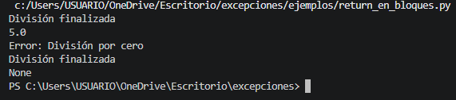

## Explicación del manejo de excepciones
- El bloque try contiene un return. Normalmente el return terminaría la función inmediatamente, pero la presencia de finally cambia el orden.

- Si hay una excepción, se ejecuta el except, que también tiene un return.

- En cualquier caso, antes de ejecutar el return correspondiente, Python ejecuta completamente el bloque finally.

# Ejemplo 32 - Consideraciones importantes: Excepciones en finally

```python
try:
    1 / 0  # Genera ZeroDivisionError
except ZeroDivisionError:
    print("Capturada división por cero")
    # La excepción ha sido manejada
finally:
    # Si descomentas la siguiente línea, el ZeroDivisionError original se perderá
    # y será reemplazado por este ValueError
    # int("abc")  # Genera ValueError
    print("Bloque finally ejecutado")
```

## ¿Qué hace el código?
El bloque try genera un ZeroDivisionError. El except lo captura y muestra "Capturada división por cero". Luego se ejecuta el finally, que imprime "Bloque finally ejecutado". No hay excepción en finally, todo funciona normalmente.

## Salida
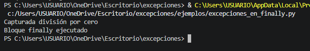

## Explicación del manejo de excepciones
- El bloque except captura y maneja el ZeroDivisionError, evitando que termine el programa.

- El finally se ejecuta después, incluso si ya se manejó una excepción.

- Si dentro de finally ocurre otra excepción, esta nueva excepción reemplaza a cualquier excepción anterior (manejada o no). El programa lanzará el ValueError, y el ZeroDivisionError original ya no se verá.

# Ejemplo 33 - Lanzar excepciones: Usando la instruccion raise

```python
def dividir(a, b):
    if b == 0:
        raise ZeroDivisionError("No se puede dividir entre cero")
    return a / b

try:
    resultado = dividir(10, 0)
except ZeroDivisionError as e:
    print(f"Error:{e}")
```

## ¿Qué hace el código?
Define una función dividir(a, b) que primero verifica si b es cero. Si lo es, lanza (raise) una excepción ZeroDivisionError con un mensaje personalizado "No se puede dividir entre cero". Si b no es cero, realiza la división normalmente. Luego, en el bloque try-except, se llama a la función con (10, 0), se captura la excepción lanzada y se imprime el mensaje de error.

## Salida
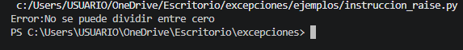

## Explicación del manejo de excepciones
- Se usa raise para lanzar una excepción de forma intencional cuando se detecta una condición inválida (divisor igual a cero).

- El mensaje personalizado se pasa como argumento al crear la excepción.

- En el try se llama a la función que puede lanzar la excepción.

- El except captura específicamente ZeroDivisionError y muestra el mensaje asociado (e).

# Ejemplo 34 - Cuándo lanzar excepciones: Validación de parametros

```python
def calcular_raiz_cuadrada(numero):
    if numero < 0:
        raise ValueError("No se puede calcular la raíz cuadrada de un número negativo")
    return numero ** 0.5
```

## ¿Qué hace el código?
Define una función que calcula la raíz cuadrada de un número. Si el número es negativo, lanza un ValueError con un mensaje personalizado. Si es positivo o cero, devuelve la raíz.

## Salida
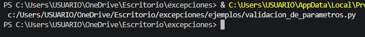

## Explicación del manejo de excepciones
La función lanza una excepción cuando recibe un parámetro inválido (negativo). Esto evita que la función devuelva un valor incorrecto (como un número complejo) sin que el programa se dé cuenta. Quien llame a la función deberá capturar la excepción con try-except.

# Ejemplo 35 - Cuándo lanzar excepciones: Estados imposibles

```python
python
def procesar_respuesta(respuesta):
    if respuesta.codigo == 200:
        return respuesta.datos
    elif respuesta.codigo == 404:
        return None
    else:
        raise RuntimeError(f"Código de respuesta no manejado:{respuesta.codigo}")
```

## ¿Qué hace el código?
La función procesar_respuesta(respuesta) recibe un objeto respuesta que tiene un atributo codigo. Si el código es 200 (éxito), devuelve los datos. Si es 404 (no encontrado), devuelve None. Para cualquier otro código no contemplado (estado imposible o no manejado), lanza una excepción RuntimeError con un mensaje indicando el código recibido.

## Salida
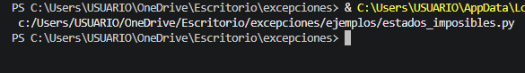

## Explicación del manejo de excepciones
Se usa raise para lanzar una excepción cuando el programa llega a un estado que no debería ocurrir (código de respuesta desconocido). Esto ayuda a detectar errores de lógica o cambios inesperados en la API. Quien llame a esta función deberá capturar RuntimeError para manejarlo adecuadamente.

# Ejemplo 36 - Cuándo lanzar excepciones: Precondiciones no cumplidas

```python
def retirar_dinero(cuenta, cantidad):
    if not cuenta.esta_activa:
        raise ValueError("La cuenta no está activa")

    if cantidad <= 0:
        raise ValueError("La cantidad debe ser positiva")

    if cantidad > cuenta.saldo:
        raise ValueError("Saldo insuficiente")

    cuenta.saldo -= cantidad
    return cuenta.saldo
```

## ¿Qué hace el código?
Define una función retirar_dinero(cuenta, cantidad) que verifica varias precondiciones antes de realizar el retiro:

- La cuenta debe estar activa.

- La cantidad a retirar debe ser positiva.

- La cantidad no debe superar el saldo disponible.

- Si alguna precondición falla, lanza un ValueError con un mensaje específico. Si todas se cumplen, resta la cantidad al saldo y devuelve el nuevo saldo.

## Salida
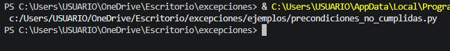

## Explicación del manejo de excepciones
Se lanzan excepciones cuando el programa recibe datos inválidos o el estado no permite la operación. Esto evita que la función continúe con valores incorrectos (por ejemplo, retirar dinero de una cuenta inactiva). Quien llame a la función deberá capturar ValueError y mostrar el mensaje correspondiente.

# Ejemplo 37 - Tipos de excepciones comunes para lanzar: ValueError

```python
def establecer_edad(edad):
    if not isinstance(edad, int):
        raise TypeError("La edad debe ser un número entero")
    if edad < 0 or edad > 150:
        raise ValueError("La edad debe estar entre 0 y 150 años")
    return edad
```

## ¿Qué hace el código?
- Define una función establecer_edad(edad) que valida el argumento:

- Primero verifica si edad es de tipo int. Si no lo es, lanza un TypeError con un mensaje apropiado.

- Luego verifica si edad está entre 0 y 150 (inclusive). Si está fuera de ese rango, lanza un ValueError con un mensaje específico.

- Si pasa ambas validaciones, devuelve la edad.

## Salida
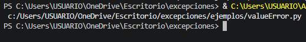

## Explicación del manejo de excepciones
- Se usa TypeError cuando el tipo del argumento es incorrecto (se esperaba un entero y se recibió, por ejemplo, un string o un float).

- Se usa ValueError cuando el tipo es correcto (entero) pero el valor está fuera del rango permitido (negativo o mayor a 150).

- Esta distinción ayuda a quien llama a la función a saber exactamente qué tipo de error ocurrió y manejarlo de forma diferente.

# Ejemplo 38 - Tipos de excepciones comunes para lanzar: TypeError

```python
def concatenar(texto, repeticiones):
    if not isinstance(texto, str):
        raise TypeError("El primer argumento debe ser una cadena de texto")
    if not isinstance(repeticiones, int):
        raise TypeError("El segundo argumento debe ser un número entero")
    return texto * repeticiones
```

## ¿Qué hace el código?
- Define una función concatenar(texto, repeticiones) que valida los tipos de los argumentos:

- Verifica que texto sea una cadena (str). Si no, lanza TypeError.

- Verifica que repeticiones sea un entero (int). Si no, lanza TypeError.

- Si ambos son del tipo correcto, devuelve el texto repetido repeticiones veces (usa el operador * de multiplicación de strings).

## Salida
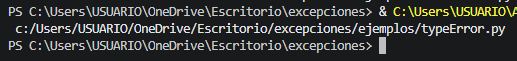

## Explicación del manejo de excepciones
Se lanza TypeError cuando el tipo de un argumento no es el esperado. Esto ayuda a detectar errores en tiempo de ejecución, como pasar un número en lugar de texto o viceversa. Quien llame a la función debe capturar TypeError para manejar estos casos.